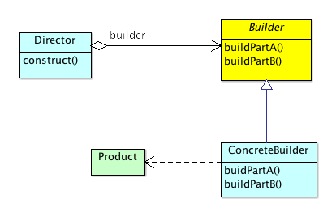
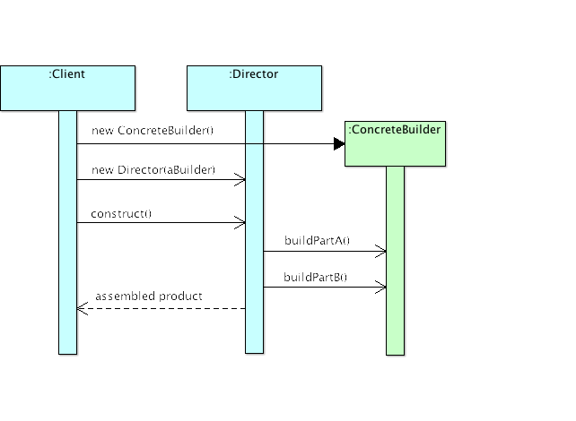

# Builder Pattern

## Overview

The Builder design pattern provides a way to:

>separate the construction of a complex object from its representation so that the same construction process can create different representations.—[Gang of Four][gof]

The Builder pattern is a creational pattern that allows for abstracting the creation of related but complex objects; this is done by utilizing concrete builders that independently construct and assemble products as appropriate.

 

## Participants and Collaborations

The participants in Builder are:

* **Builder:** Provides an interface for building parts of the complex object
* **ConcreteBuilder:** Assembles the parts that make up the object
* **Director:** Builds complex objects by delegating to the Builder
* **Product:** Represents the complex object being constructed

 

The assembly of the product involves the following collaborations:

* Client creates Builder and Director objects (injecting Director with Builder)
* Client calls _construct_ (or similar) on Director
* Director calls appropriate series of Builder _build_ operations 
* Director calls get<Product Name> on the Builder getting the fully assembled product. 

## Implementation

Imagine the following _happy hour_ scenario:

* You order a drink from a waitress at a pub
* The Waitress (the _Director_), takes down your order
* She then asks the Bartender (the _Builder_) to prepare your drinks
* Once the drinks are ready, she puts them on her tray, walks over and serves them to you 

If you think about it, the above happy hour scenario is really quite similar to how Builder pattern works. Let's, in fact, put this example to code...first we'll start with the tests:

```javascript

// Install node.js, npm, mocha.js, and sinon.js:
// $ npm install -g mocha
// $ npm install sinon
// $ mocha --ignore-leaks
var sinon, assert, 
	IBartender, Bartender, Waitress, DrinkMenu;

assert = require('assert');
sinon = require('sinon');
IBartender = require("../builder.js").IBartender;
Bartender = require("../builder.js").Bartender;
Waitress = require("../builder.js").Waitress;
DrinkMenu = require("../builder.js").DrinkMenu;

describe("Builder tests", function() {
	var bartender, waitress;
	beforeEach(function() {
		bartender = new Bartender();
		waitress = new Waitress(bartender, DrinkMenu);
	});
	afterEach (function() {
		bartender = null;
		waitress = null;
	});

	it("should take an order for mojito", function() {
		var spy = sinon.spy(bartender, "prepareMojito");
		waitress.takeOrder([DrinkMenu.mojito]);
		assert(spy.called);
		bartender.prepareMojito.restore();
	});

	it("should take order for all drinks on menu", function() {
		var allDrinks=[], 
			key, 
			allSpies={};

		// Spy on each of the Bartender's prepareXXX methods
		for(key in DrinkMenu) {
			allSpies[key] = sinon.spy(bartender, DrinkMenu[key]);
			allDrinks.push(DrinkMenu[key]);
		}

		waitress.takeOrder(allDrinks);

		// Assert Bartender's prepareXXX methods called; restore
		for(key in allSpies) {
			assert(allSpies[key].called);
		}
		for(key in DrinkMenu) {
			bartender[DrinkMenu[key]].restore();
		}
	});

	it("should only take Array of valid drink types", function() {
		var result;
		result = waitress.takeOrder("invalid type");
		assert.equal(null, result);
		result = waitress.takeOrder(['not_a_drink!']);
		assert.equal(null, result);
		result = waitress.takeOrder([DrinkMenu.mai_tai,
									'not_a_drink!',
									DrinkMenu.pina_colada]);
		assert.equal(null, result);
		result = waitress.takeOrder(undefined);
		assert.equal(null, result);
		result = waitress.takeOrder(null);
		assert.equal(null, result);
	});
	it("should return correct number of drinks", function() {
		var drinksServed =
			waitress.takeOrder([DrinkMenu.mojito,
								DrinkMenu.mai_tai]);
		assert.equal(2, drinksServed.length);
	});		
	it("should allow duplicate drinks to be ordered", function() {
		var drinksServed =
			waitress.takeOrder([DrinkMenu.mojito,
								DrinkMenu.mai_tai,
								DrinkMenu.mai_tai,
								DrinkMenu.margarita,
								DrinkMenu.mai_tai]);
		assert.equal(5, drinksServed.length);
	});
});

```

### Implementation

And here's our implementation:

```javascript
var DrinkMenu = {
	beer: "prepareBeer",
	mojito: "prepareMojito",
	kamikaze: "prepareKamikaze",
	margarita: "prepareMargarita",
	mai_tai: "prepareMaiTai",
	pina_colada: "preparePinaColada"
};

var IBartender = function() {};
IBartender.prototype[DrinkMenu.mojito] = function() {
	throw new Error("Method must be implemented."); 
};
IBartender.prototype[DrinkMenu.kamikaze] = function() {
	throw new Error("Method must be implemented."); 
};
IBartender.prototype[DrinkMenu.mai_tai] = function() {
	throw new Error("Method must be implemented."); 
};
IBartender.prototype[DrinkMenu.margarita] = function() {
	throw new Error("Method must be implemented."); 
};
IBartender.prototype[DrinkMenu.beer] = function() {
	throw new Error("Method must be implemented."); 
};
IBartender.prototype[DrinkMenu.pina_colada] = function() {
	throw new Error("Method must be implemented."); 
};


var Bartender = function() {
	this.drinks = [];	
};
Bartender.prototype = new IBartender(); 
Bartender.prototype[DrinkMenu.beer] = function() {
	this.drinks.push("Beer");
};
Bartender.prototype[DrinkMenu.mojito] = function() {
	this.drinks.push("Mojito");
};
Bartender.prototype[DrinkMenu.kamikaze] = function() {
	this.drinks.push("Kamikaze");
};
Bartender.prototype[DrinkMenu.mai_tai] = function() {
	this.drinks.push("Mai Tai");
};
Bartender.prototype[DrinkMenu.margarita] = function() {
	this.drinks.push("Margarita");
};
Bartender.prototype[DrinkMenu.pina_colada] = function() {
	this.drinks.push("Pina Colada");
};
Bartender.prototype.ordersUp = function() {
	return this.drinks;
};


var Waitress = function(bartender, menu) {
	this.bartender = bartender;
	this.menu = menu;
};

// Precondition: drinks elements must be valid DrinkMenu items 
Waitress.prototype.takeOrder = function(drinks) {
	var i, order = [], self = this;

	function isBartenderFunction(key) {
		return typeof self.bartender[key]==="function";
	}

	if(Array.isArray(drinks)) {
		for (i = 0; i < drinks.length; i++) {
			if (isBartenderFunction(drinks[i])) {
				order.push(self.bartender[drinks[i]]());
			} else {
				return null;
			}
		}
		return (order.length) ? self.bartender.ordersUp() : null;
	}
	return null;
};

module.exports.IBartender = IBartender;
module.exports.Bartender = Bartender;
module.exports.Waitress = Waitress;
module.exports.DrinkMenu = DrinkMenu;
```

## Pitfalls

The BuilderPattern doesn't seem to commit many flagrant violations of object-oriented principles. However, as with most design patterns, it does add some complexity. Also, there is a more modern version of Builder pattern that you'll see that uses [Fluent Interfaces][fluent], but this is beyond the scope of this chapter. [Here's an interesting article][fluent_builder] if you'd like to learn more about that approach.

## Summary

The Builder pattern allows us to decouple our client code from the construction of complex objects. It can be used to make our code more testable. For example, if we have an object with a ["busy constructor"][misko_constructors](a constructor doing object instantiation; a big testability no no!), one option we have is to refactor to have the constructor take a builder object. It can then use the builder's operations to initialize its member variables. This is really an alternative form of constructor [dependency injection][di_demystified], a technique that allows test code to control how an object under test's dependents are constructed. 

