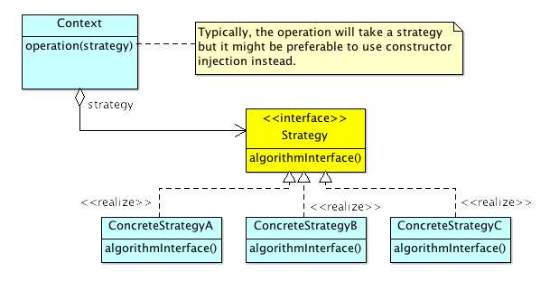

# Strategy Pattern

 

## Overview

The Strategy pattern allows us to:

> Define a family of algorithms, encapsulate each one, and make them interchangeable. Strategy lets the algorithm vary independently from clients that use it—[Gang of Four][gof]

## Features

Strategy pattern provides the following benefits:

* provides a way to add variants of an algorithm by means of composition (as opposed to using inheritance like we did in Template Method)
* provides an alternative to conditional branching moving the variant algorithms in to their own Strategy classes
* allows you to add algorithms without having to reopen the base class; thus it complies with open/closed principle

## Participants

* **Strategy:** Provides the common interface that all strategy algorithms will implement
* **ConcreteStrategy:** The classes that implement above Strategy interface 
* **Context:** Gets injected with a particular ConcreteStrategy object at run-time 

## Implementation

Sticking to the audio analogy, let's imagine a simple web audio player that provides a way to _play_ and _pause_ (we'll keep it simple). We'd like to be able to switch between using an HTML5 audio implementation and a custom SWF implementation (Flash). Let's assume there's a mechanism in place such that the system knows at run-time whether it should use HTML5 or Flash for playing audio (this might be achieved via browser detection, URL naming conventions, etc.).

In the future we can imagine needing to add additional support for other audio formats (e.g. we may use a Java applet to play Ogg Vorbis audio, etc.). Thus we need an implementation that provides flexibility.

In this example, we'll be using JavaScript. Here are the mocha tests:

```javascript

// Install node.js, npm, mocha.js, and sinon.js:
// $ npm install -g mocha
// $ npm install sinon
// $ mocha --ignore-leaks
var sinon, assert, IStrategy, 
	HTML5AudioPlayer, SWFAudioPlayer, AudioPlayer;

assert = require('assert');
sinon = require('sinon');
IStrategy = require("../strategy.js").IStrategy;
HTML5AudioPlayer = require("../strategy.js").HTML5AudioPlayer;
SWFAudioPlayer = require("../strategy.js").SWFAudioPlayer;
AudioPlayer = require("../strategy.js").AudioPlayer;

describe("strategy tests", function() {
	var html5AudioPlayer, swfAudioPlayer;

	beforeEach(function() {
		html5AudioPlayer = new HTML5AudioPlayer();
		swfAudioPlayer = new SWFAudioPlayer();
	});
	afterEach (function() {
		html5AudioPlayer = null;
		swfAudioPlayer = null;
	});

	it("should play html5 audio", function() {
		var playSpy, player;

		playSpy = sinon.spy(html5AudioPlayer, "play");
		player = new AudioPlayer(html5AudioPlayer);

		player.playAudio();
		assert(playSpy.called);
		html5AudioPlayer.play.restore();
	});

	it("should pause html5 audio", function() {
		var pauseSpy, player;

		pauseSpy = sinon.spy(html5AudioPlayer, "pause");
		player = new AudioPlayer(html5AudioPlayer);

		player.playAudio();
		player.pauseAudio();
		assert(pauseSpy.called);
		html5AudioPlayer.pause.restore();
	});

	it("should play Flash audio", function() {
		var playSpy, player;

		playSpy = sinon.spy(swfAudioPlayer, "play");
		player = new AudioPlayer(swfAudioPlayer);

		player.playAudio();
		assert(playSpy.called);
		swfAudioPlayer.play.restore();
	});

	it("should pause Flash audio", function() {
		var pauseSpy, player;

		pauseSpy = sinon.spy(swfAudioPlayer, "pause");
		player = new AudioPlayer(swfAudioPlayer);

		player.playAudio();
		player.pauseAudio();
		assert(pauseSpy.called);
		swfAudioPlayer.pause.restore();
	});
});

```

Here is our implementation (note that our AudioPlayer is the _Context_ and gets the Strategy object injected in into its constructor. Another variation is to pass the Strategy object to each operation directly; this provides later binding. However, binding early in the constructor does ensure our object is consistently initialized _before_ any of its methods get called.).

```javascript

var IStrategy = function() {};
IStrategy.prototype = {
	play: function() {
		throw new Error("Method must be implemented."); 
	},
	pause: function() {
		throw new Error("Method must be implemented."); 
	}
};

var HTML5AudioPlayer = function() {};
HTML5AudioPlayer.prototype = new IStrategy(); 
HTML5AudioPlayer.prototype = {
	play: function() {
		console.log("Playing HTML5 audio...");
	},
	pause: function() {
		console.log("Pausing HTML5 audio...");
	}
};

var SWFAudioPlayer = function() {};
SWFAudioPlayer.prototype = new IStrategy(); 
SWFAudioPlayer.prototype = {
	play: function() {
		console.log("Playing SWF audio...");
	},
	pause: function() {
		console.log("Pausing SWF audio...");
	}
};

var AudioPlayer = function(playerStrategy) {
	this.player = playerStrategy;
};
AudioPlayer.prototype = {
	playAudio: function() {
		this.player.play();
	},
	pauseAudio: function() {
		this.player.pause();
	}
};

module.exports.IStrategy = IStrategy;
module.exports.HTML5AudioPlayer = HTML5AudioPlayer;
module.exports.SWFAudioPlayer = SWFAudioPlayer;
module.exports.AudioPlayer = AudioPlayer;
```

## Pitfalls

The following are some disadvantages to Strategy patter:

* **Interface coupling:** As the context depends on the Strategy's interface, there's some coupling between the two 
* **Complexity:** Sometimes conditional branching is more immediately understandable than dynamic strategy algorithms (while the later is more flexible, you may not need it) 
* **Clients must decide which strategy to use:** Clients must be able to select the correct Strategy algorithm to be injected in to the Context; sometimes this knowledge is non-trivial and adds complexity

## Summary

The Strategy pattern puts families of algorithms in to classes that can be "plugged in" at runtime. As the strategy pattern uses composition instead of inheritance, it provides a nice alternative to subclassing. Because these strategy algorithms can be injected at run-time, it's fairly trivial to add behaviors to the system. This complies with the open/closed principle which states that objects should be open for change but closed for modification.

